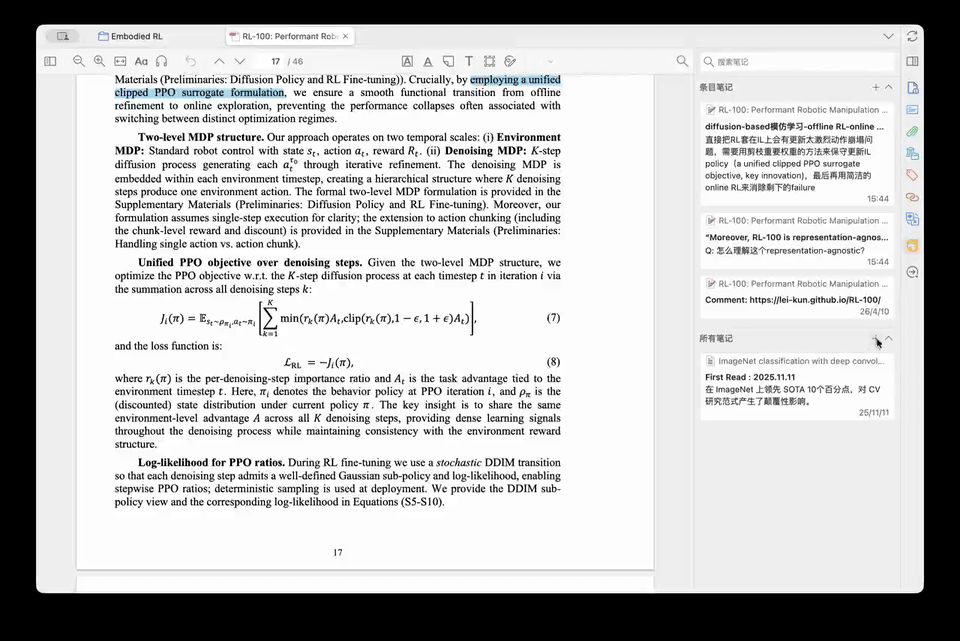

<p align="center">
  
</p>

# Zotero Paper Partner

A Zotero plugin that answers `Q:` questions you write inside notes — silently, in the background, without breaking your reading flow.


[中文说明](./README.zh-CN.md)

[](./assets/demo.mp4)

---

## The idea

This plugin is for a very specific moment: you're reading a paper, something doesn't click, and you don't want to stop everything just to ask AI about it.

So instead of opening a chat window, pasting context, and breaking your flow, you just type a `Q:` in the Zotero note you're already writing. Then you keep going. A little later, the answer shows up right under the question.

```
The model uses a representation-agnostic objective.
Q: What does representation-agnostic mean here?

A[done]: It means the method does not depend on a specific internal representation,
but works across different ways of encoding the same underlying information.
```

That's really the whole idea: keep the question, the context, and the answer in one place, and don't make reading feel heavier than it already is.

## Why it feels different

**Stay in the note.** Most AI reading tools ask you to step out of your notes and into some other interface. This one doesn't. The question lives in your note, the answer comes back to that same note, and what you end up with is still just a normal reading note you can keep.

**Don't break the flow.** You write `Q:`, press Enter, and move on. The plugin waits a moment, works in the background, and fills in the answer when it's ready. If you change the note while it's working, it marks the result as stale instead of pretending the old answer is still valid.

**Any coding Agent can reproduce.** If you want to rebuild or extend it, this repo includes [`target.md`](./target.md), which is basically the original spec that shaped the whole plugin. You can hand that file to a coding agent and get a solid reproduction path without having to reverse-engineer the idea from scratch.

---

## Install

Download `paper-partner.xpi` from GitHub Releases, then in Zotero: `Tools → Plugins → Install Add-on From File`.

## Configure

`Zotero Preferences → Paper Partner` — set your API key, endpoint, model, answer mode, and trigger delay. Defaults to DeepSeek's OpenAI-compatible API.

## Q&A

**Which APIs are supported?**  
Paper Partner calls an OpenAI-compatible Chat Completions endpoint. DeepSeek works by default, and services such as OpenAI, Kimi/Moonshot, Alibaba Bailian DashScope, SiliconFlow, and OpenRouter can usually work by filling in their endpoint and model name. Provider presets are not built in yet.

**What should I put in API Endpoint?**  
Use the full chat completions URL, for example `https://api.deepseek.com/v1/chat/completions`. If a provider's docs only show a `base_url`, you usually need to append `/chat/completions`.

**What is the difference between Brief and Detailed?**  
Brief is designed to avoid breaking your reading flow: it only explains the term or sentence you asked about, and keeps the answer very short. Detailed gives a fuller explanation of the concept, mechanism, and causal relationship, but still does not summarize the whole paper.

**What is Trigger Delay?**  
It controls how long the plugin waits after you press Enter into a new paragraph before it starts processing the question. Immediate is 0 seconds, Short is 1 second, Medium is 2 seconds, and Long is 3 seconds.

**Why do I see `A[error]: ...`?**  
This means the plugin received an API error, an empty response, or a model response that was cut off by the token limit. Delete the `A[error]: ...` line, then slightly rephrase the question or shorten the context and press Enter again to trigger a new request.

## Requirements

Zotero 7+ (tested on Zotero 9). Any OpenAI-compatible API endpoint works.

---

## Note

This project was built with a very heavy dose of vibe coding, honestly something like 99% of it. The core prompt/spec is public in [`target.md`](./target.md), so the project is not just open source, but also fairly open-prompt.
